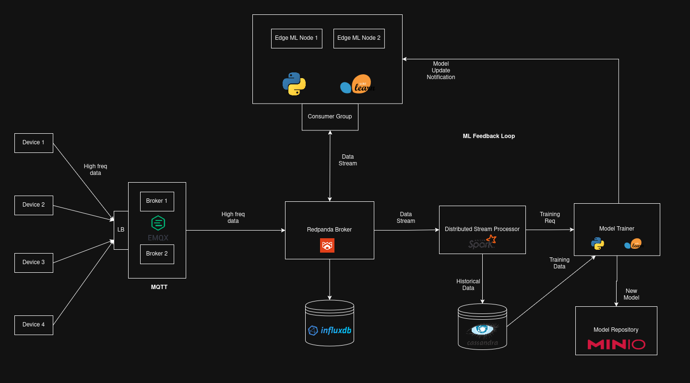

# Distributed 5G IoT Gateway System

A distributed IoT system with edge processing, real-time ML inference, and cloud analytics.

## Architecture


```
EDGE (K3s)                              CLOUD (Docker Compose)

IoT Devices → EMQX → Ingestion          Cloud Uplink
    → Redpanda(raw)                         ↓
    → Transformation                     Cloud Redpanda
    → Redpanda(transformed)                 ↓
    ├→ InfluxDB Writer → InfluxDB        Cassandra Writer → Cassandra
    └→ Cloud Uplink ──────────────→      Cloud API (FastAPI)
                                         Spark Job → MinIO (ML models)
```

**Key Features**: Fault-tolerant edge gateway, per-device data ordering, cloud analytics pipeline.

## Quick Start

See [QUICKSTART.md](QUICKSTART.md) for detailed instructions.

```bash
# 1. Start cloud infrastructure
cd cloud && ./start-cloud.sh

# 2. Build & deploy edge
cd edge && ./k3s-build-images.sh && ./k3s-deploy.sh

# 3. Run simulator
cd simulator && ./run-simulator.sh
```

## Tech Stack

**Edge (K3s):**
- EMQX (MQTT Broker - StatefulSet, clustered)
- Redpanda (Message Queue - StatefulSet)
- InfluxDB (Time-series Buffer - DaemonSet, 7-day retention)
- Ingestion Service (Python, HPA)
- Transformation Service (Python, HPA)
- InfluxDB Writer (Python, HPA)
- Cloud Uplink (Python, HPA)
- Device Registry (Python FastAPI)

**Cloud (Docker Compose):**
- Redpanda (Message Bus)
- Cassandra (Time-series DB, 90-day retention)
- MinIO (S3-compatible Data Lake)
- Cassandra Writer (Python)
- Cloud API (Python FastAPI)
- Spark Job (Python ML training)

## Development Phases

- **Phase 1** ✅ K3s edge gateway with MQTT, streaming, and auto-scaling
- **Phase 2** ✅ Cloud integration (Redpanda, Cassandra, API, Spark)
- **Phase 3** (Planned): Edge ML inference for real-time anomaly detection

## Requirements

- **K3s** (lightweight Kubernetes for edge)
- **Docker** and **docker-compose** (for building images and cloud services)
- **Python 3.11+** (for simulator)

## Documentation

- [QUICKSTART.md](QUICKSTART.md) - Setup and deployment guide
- [PROJECT_STRUCTURE.md](PROJECT_STRUCTURE.md) - Detailed project structure
- See `docs/` for architecture diagrams
